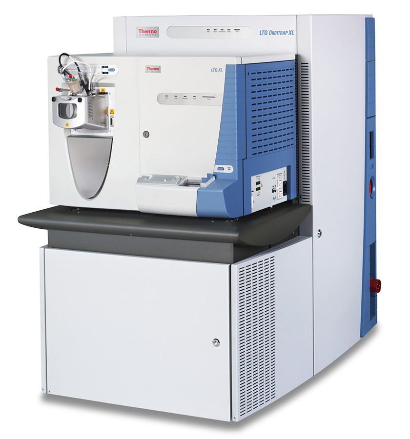

```{r setup, include=FALSE}
knitr::opts_chunk$set(echo = TRUE, fig.align = "center")
```

## Abstract
We received data on wine metabolomics from the Max Planck Institute for Molecular and Plant Physiology in Potsdam. these data are measurements of peaks of metabolic intensity and represent a metabolomic footprint of each wine. the data were processed, standardized and analyzed by us. Our Goal was to classify/distinguish wine attributes like variety, origin, vintage, and quality by the use of metabolomic data and most important to correlate wine quality with wine metabolomics.

## 1 Introduction

Metabolomics is an emerging field in grape and wine research enabling chemical and biochemical profiling of samples (wine) in order to obtain insight into its biological characteristics and properties (1). 
Metabonomics is defined as "the quantitative measurement of the dynamic multiparametric metabolic response of living systems to pathophysiological stimuli or genetic modification" (2). In simple words it is the science which studies the small molecules present in a sample as the result from primary and secondary metabolism. The small molecules can be measured by the use of Mass Spectrometry, which is a technique that ionizes chemical species and sorts the ions based on their mass-to-charge ratio. In simpler terms, a mass spectrum measures the masses within a sample (3).

 {width=400px} (4)

The aim of this report is to provide a comparison of different wine metabolomic profiles and its correlation with the human quality classification of wine. With our results we expect to use wine metabolomics to study wine classification and authentication.

## 2 Material and Methods

### 2.1 Wine Samples
Around 300 monovarietal commercial Chilean wines, elaborated by different vineyards (Viña Concha y Toro, Viña San Pedro, Viña los Vascos, Viña Undurraga, Viña Aresti and Viña Tamaya), from different pure cultivars [(100% Carmenre, 100% Cabernet Sauvignon, 100% Merlot, 100% Syrah and wine mix], from different vintages (2002, 2003, 2004, 2005, and 2006) and different quality scores premium-quality (high), reserve-quality (medium), and varietal-quality (low), were directly analyzed from each bottle. 
3 ml of each wine sample was stored, each with six technical replicas.

: Table 1:  Overview of all sampled Chilenean wines (with price tag).

+---------------+---------------+---------------+----------+
| Original      |               |               |          |
| Abbreviation  | Wine yard     | Wine type     | Price *   |
+===============+===============+===============+==========+
| VASCOS        | Vascos        | Cabernet-     | EUR 11   |
|               |               | sauvignon     |          |
+---------------+---------------+--------------------------+
| VSP           | San Pedro     | Cabernet-     | EUR 5    |
|               |               | sauvignon     |          |
+---------------+---------------+--------------------------+
| A             | Aresti        | Cabernet-     | EUR 3-5  |
|               |               | sauvignon     |          |
+---------------+---------------+--------------------------+
| CT            | Concha Y Toro | Cabernet-     | EUR 7    |
|               |               | sauvignon     |          |
+---------------+---------------+--------------------------+
| T_CCMS        | Tocornal      | Cabernet-     | EUR 5    |
|               |               | sauvignon,    |          |
|               |               | Carmenere,    |          |
|               |               | Syrah**       |          |
+---------------+---------------+--------------------------+
| TA_CF         | Tarapacá      | Cabernet      | EUR 5-6  |
|               |               | Franc         |          |
+---------------+---------------+--------------------------+
| U             | Undurraga     | Cabernet-     | EUR 7-10 |
|               |               | sauvignon     |          |
+---------------+---------------+--------------------------+
| A_CARM        | Aresti        | Carmenere     | EUR 6-9  |
|               |               |               |          |
+---------------+---------------+--------------------------+
| A_CCM         | Aresti        | Carmenere,    | EUR 11-13|
|               |               | Cabernet-     |          |
|               |               | sauvignon,    |          |
|               |               | Merlot**      |          |
+---------------+---------------+--------------------------+
| A_SYRAH       | Aresti        | Syrah         | EUR 12-15|
|               |               |               |          |
+---------------+---------------+--------------------------+
| T_MCSS        | Tocornal      | Merlot,       | EUR 3-5  |
|               |               | Cabernet-     |          |
|               |               | sauvignon,    |          |
|               |               | Syrah**       |          |
+---------------+---------------+--------------------------+
| TA_SYRAH      | Tarapacá      | Syrah         | EUR 3-5  |
|               |               |               |          |
+---------------+---------------+--------------------------+
| TA_M          | Tarapacá      | Merlot        | EUR 11   |
|               |               |               |          |
+---------------+---------------+--------------------------+
| U_CM          | Undurraga     | Carmenere     | EUR 3-9  |
|               |               |               |          |
+---------------+---------------+--------------------------+

*price in Euros obtain from online sellers

**mixtures of different grape cultivars

### 2.2 Metabolomic Measurement

In brief: 2 ml of each wine (bottle) sample were loaded per injection into the Mass spectrometer.  A set of six experimental sample technical replicates per wine were measured.

The metabolomic process involves: taking a small sample from each bottle, detection, spectral analysis, generation of a "sample specific" fingerprint.

The metabolomic profiling analysis of all samples were carried out from the Max Planck institute of Molecular and plant physiology in Potsdam together with the University of Santiago de Chile. 


We receive the raw files including: molecular masses, retention time and associated peak intensities. 

### 2.3 Data Preprocessing

The data came in a .txt file and was preprocessed for easier further analysis with R Studio.
```{r transform and save}
# # Transform raw data
# data <- read.delim("../300_Wine_pos.txt")
# wine_data <- data[,4:303]
# 
# # Split the name column into several columns and transpose dataframe 
# quality <- matrix(ncol=1, nrow=dim(wine_data)[2])
# bottlenum <- matrix(ncol=1, nrow=dim(wine_data)[2])
# posneg <- matrix(ncol=1, nrow=dim(wine_data)[2])
# year <- matrix(ncol=1, nrow=dim(wine_data)[2])
# name <- matrix(ncol=1, nrow=dim(wine_data)[2])
# 
# for (i in 1:dim(wine_data)[2]) {
#   quality[i] <- substr(colnames(wine_data)[i],4,4)
#   letters <- nchar(colnames(wine_data)[i])
#   bottlenum[i] <- substr(colnames(wine_data)[i],letters,letters)
#   posneg[i] <- substr(colnames(wine_data)[i],letters-4,letters-2)
#   year[i] <- substr(colnames(wine_data)[i],letters-7,letters-6)
#   name[i] <- substr(colnames(wine_data)[i],6,letters-9)
# }
# t_wine_data <- as.data.frame(t(wine_data))
# colnames(t_wine_data) = data$MZ
# 
# wine <- cbind(name, year, posneg, bottlenum, quality, t_wine_data)
# 
# # change colnames to friendly ones just a number 
# true_colnames <-colnames(wine)
# colnames(wine)[6:5745] <- c(1:5740)
# 
# # change rownames to friendly ones, sequence 1:300
# rownames(wine) <- seq(1,300) 
# 
# # change colum "name" to two columns one for wineyard the other for wine type
# wineyard <- {}
# winetype <- {}
# 
# for (i in 1:300) {
#   if  (wine[i,1] == "A") {
#     wineyard[i] <- "Aresti"
#     winetype[i] <- "Cabernet-sauvignon"
#   }
#   else if   (wine[i,1] == "A_CARM") {
#       wineyard[i] <- "Aresti"
#       winetype[i] <- "Carmenere"
#   }
#   else if   (wine[i,1] == "A_CCM") {
#       wineyard[i] <- "Aresti"
#       winetype[i] <- "Mix"
#   }
#   else if   (wine[i,1] == "A_SYRAH") {
#       wineyard[i] <- "Aresti"
#       winetype[i] <- "SYRAH"
#   }
#   else if   (wine[i,1] == "CT") {
#     wineyard[i] <- "Concha y Toro"
#     winetype[i] <- "Cabernet-sauvignon"
#   }
#   else if   (wine[i,1] == "T_CCMS") {
#     wineyard[i] <- "Tocornal"
#     winetype[i] <- "Mix"
#   }
#   else if   (wine[i,1] == "T_CCMS") {
#     wineyard[i] <- "Tocornal"
#     winetype[i] <- "Mix"
#   }
#   else if   (wine[i,1] == "TA_CF") {
#     wineyard[i] <- "Tarapaca"
#     winetype[i] <- "Cabernet Franc"
#   }
#   else if   (wine[i,1] == "TA_M") {
#     wineyard[i] <- "Tarapaca"
#     winetype[i] <- "Merlot"
#   }
#   else if   (wine[i,1] == "TA_SYRAH") {
#     wineyard[i] <- "Tarapaca"
#     winetype[i] <- "SYRAH"
#   }
#   else if   (wine[i,1] == "U") {
#     wineyard[i] <- "Undurraga"
#     winetype[i] <- "Cabernet-sauvignon"
#   }
#   else if   (wine[i,1] == "U_CM") {
#     wineyard[i] <- "Undurraga"
#     winetype[i] <- "Carmenere"
#   }
#   else if   (wine[i,1] == "U_CM_") {
#     wineyard[i] <- "Undurraga"
#     winetype[i] <- "Carmenere"
#   }
#   else if   (wine[i,1] == "VASCOS") {
#     wineyard[i] <- "VASCOS"
#     winetype[i] <- "Cabernet-sauvignon"
#   }
#   else {
#     wineyard[i] <- "San Pedro" 
#     winetype[i] <- "Cabernet-sauvignon"
#   }
# }
# 
# # join the new columns
# wine2 <- cbind(wineyard,winetype,wine[,2:5745])
# wine <- wine2
# wine[1:5,1:10]
# 
# # save new data as .RdA and .csv
# save(wine, file="wine.Rda")
# write.csv(wine, file = "wine.csv")
```

Eventually the data was in the following transposed format with which all further analysis were made. The data is in a wide format and has a total of 300 rows for each wine sample and 5746 columns whereas column 7 to 5746 are the individual metabolomic measurements (peaks).


```{r}
load("wine.RdA")
# dim(wine)
# => [1] 300 5746
head(wine[,c(1:9, 5745:5746)]) # show first 6 rows and first nine and last two columns
```

### 2.4 Procedure

During the course of this report we will test whether the quality of the wines (P,V,R) is related to their metabolomic profile. We will go through several descriptive analyses of the data to get an idea of how the metabolites are organized and distributed in the different metabolic categories and later on we will use machine learning to group the data and see if they are associated with the quality reported by humans. 

This is an untargeted aproach to determine wine quality from wine metabolomics, that means for our purpose the exactly name of the metabolites is not importat, we are seaking for signals of wine quality in the complete or a sample of the metabolites. 


## 3 Analysis

```{r echo=FALSE}
# function that filters the dataframe by wine name
wine2 <- wine 
wine <- wine[,1:507]
byname <- function(winename){
  return(wine[which(wine$winetype == winename), ])
}

CabernetF <- byname("Cabernet Franc")     
Csauvignon <- byname("Cabernet-sauvignon")
Carmenere <- byname("Carmenere")          
Merlot <- byname("Merlot")            
Mix <- byname("Mix")            
SYRAH <- byname("SYRAH")
```
### 3.1 First Exploratory Data Analysis

In the following two tables we can see that the data set beholds 6 different wine types (out of which one is of type Mix) and 7 different wine yards that produce these wines. Not every wine yard produces every wine type.  
```{r}
table(wine$wineyard, wine$winetype) # see which yard produces which wine type
```

Notable is that each wine sample was taken in one of the years between 2002 and 2006. 2006 is the only year in which each wine type was sampled at least 6 times. (Every sample included 6 different bottles.)
```{r}
table(wine$year , wine$winetype) # which wine types are from which year
```

The following frequency plot (Fig 1) shows the three wine quality categories: **P**remium (high) was sampled 100 times while medium quality **R**eserve was sampled 120 times. The lowest quality category **V**arietal is assigned to the remaining 80 wine samples.
```{r}
#unique(wine$quality) 
# => P (high), R (middle), V (low)
plot(wine$quality, col= c("blue", "green", "red"),
     main = 'Fig 1: Quality') # frequency of wine quality category
```
In Figure 2, we have the 6 types of wines and the bar is divided into the quality of each wine in the data set. The only type of wine that has samples in all categories is the cabernet sauvignon and is the type of wine that has more samples as well. The carmermere and the wine mix have two different types of quality and for the other wines only one type of quality. in Figure 3, we have the same aproach for wineyard. 

```{r}
barplot(table(wine$quality, wine$winetype), col = c("blue","green", "red"),
     main = "Fig 2: Wine Type and Quality", las = 2)
legend("topright", legend = c("High", "Regular", "Low"), title="Quality",
       fill= c("blue","green", "red"), horiz=FALSE)
```

```{r}
barplot(table(wine$quality, wine$wineyard), col = c("blue","green", "red"),
     main = "Fig 3: Wineyard and Quality", las = 2)
legend("topright", legend = c("High", "Regular", "Low"), title="Quality",
       fill= c("blue","green", "red"), horiz=FALSE)
```


The Figure 4, shows the distribution of one single metabolomic measurement for each wine type. The result depict a high variance in amount of measured metabolomic for the wine types and suggests that this might correlate with the different years and/or the wine yard from which the wine sample was taken.
```{r}
plot(wine$winetype , wine[,7],
     main = 'Fig 4: Random Metabolite distribution' ) # see exemplatory metabolomic distribution in col 6 for each wine type
```

### 3.2 Interpreting the Metabolic Data 

To understand the data a bit we can look at the variability of an abundance of a random metabolite in the different types of wine, vineyard and quality , like we did in Figure 4. 

For the boxplots Figures (5,6,7,8,9 and 10), we use the same metabolite as an example, this metabolite was choosen randomly. 

``` {r, echo = FALSE}
plot(wine$winetype , wine[,40], las = 2, main = 
       "Fig 5: Variation of a Random Metabolite vs Wine Type") 
# see metabolomic distribution in col 6 for each wine type
```

Here we have the different types of wines and we see how this certain metabolite is distributed independently and distinctly from the other wine types, showing variations. 
this metabolite is found very poorly in Merlot and Cabernet Franc, but is widely spread in the syrah type of wine (Figure 5). 
``` {r, echo = FALSE}
plot(wine$wineyard , wine[,40], las = 2,
    main =  "Fig 6: Variation of a Random Metabolite vs Wineyard")
# see metabolomic distribution in col 6 for each wine type
```

In the case of vineyards (Figure 6), the metabolite is widely distributed in the Aresti wineyard samples and in the other vineyards it is present in a more or less similar proportion to the other vineyards. 

``` {r, echo = FALSE}
plot(wine$quality , wine[,40], las = 2,col= c("blue", "green", "red"), main = "Fig 7: Variation of a Random Metabolite vs Quality")
# see metabolomic distribution in col 6 for each wine type
```

Finally for the case of this random metabolite and its variation in different qualities of wine (Figure 7), we see that the values are slightly skewed and for the high and regular quality of wine also several outliers are observed. 


To check if the specific distribution of this metabolite is real and significant and not just some results obtained by chance, we will randomly change the order of the row using the sample() function in R, to randomly change the position of the metabolite values. in this way we will set new random values to each row and see if this distribution gives similar results. 

``` {r, echo = FALSE}
plot(wine$winetype , sample(wine[,40]), las = 2, main = 
       "Fig 8: shuffle rows - Random Metabolite vs Wine Type") 
# see metabolomic distribution in col 6 for each wine type
```
``` {r, echo = FALSE}
plot(wine$wineyard , sample(wine[,40]), las = 2,
    main =  "Fig 9: shuffle rows - Random Metabolite vs Wineyard")
# see metabolomic distribution in col 6 for each wine type
```
``` {r, echo = FALSE}
plot(wine$quality , sample(wine[,40]), las = 2,
     col= c("blue", "green", "red"),
     main = "Fig 10: shuffle rows - Random Metabolite vs Quality")
# see metabolomic distribution in col 6 for each wine type
```

After the shuffling we checked the distribution of the random metabolite in question in relation to the type of wine, the quality and the vineyard, and in all the boxplots we found no variation. i.e. the metabolite values were very similar in each case. This is an indicator that our data correspond to meaningful events and are not the result of random measurements (Figures 8,9 and 10). 


### 3.3 Wines Metabolics Profiles

Based on the visual inspection of the metabolomic profiles for the different types of wine, we observed differences according to the type of wine and the quality. (The relative abundance of metabolites is shown below) visually some metabolites peaks are detectable exclusively in each wine type.


```{r , echo=FALSE}
# average of the bottle of wines
MCabernetF <- {}

for (i in 1:507) {
  if (i < 8){
    MCabernetF[i] <- colnames(CabernetF)[i]
  }
  else {
    MCabernetF[i] <- as.numeric(mean(CabernetF[,i]))
  }
}

plot(MCabernetF[-c(1:7)], type = "l", main = "Fig 11: Cabernet Franc - Low Quality",
     ylab= "MZ", axes = FALSE, xlab = "Metabolites Peaks", col = "red")
Axis(side=1, labels=FALSE)
Axis(side=2, labels=TRUE)

```

Figure 11. shows the relative abundance of 300 metabolites for Cabernet Franc wines, this is a wine of low quality. If we compare it with Merlot metabolic profil  (Figure 12), we can visualy see with the eye a similarity in the profiles, but the abundance in merlot wines for these metabolites is higher. 


```{r , echo=FALSE}
# average of the quality of wines for merlot
MMerlot <- {}

for (i in 1:507) {
  if (i < 8){
    MMerlot[i] <- colnames(Merlot)[i]
  }
  else {
    MMerlot[i] <- as.numeric(mean(Merlot[,i]))
  }
}

plot(MMerlot[-c(1:7)], type = "l", main = "Fig 12: Merlot - Low Quality",
     ylab= "MZ", axes = FALSE, xlab = "Metabolites Peaks", col = "red")
Axis(side=1, labels=FALSE)
Axis(side=2, labels=TRUE)

```

The relative abundance profile for regular quality Syrah wines  is shown in the figure 13. This metabolic profile is slightly different from those of low quality wines (Figure 11 and 12), and here you can see some metabolic peaks that are not seen in the metabolic profiles from Cabernet Franc and Merlot.

``` {r , echo=FALSE}
# average of the quality of wines for SYRAH
MSYRAH <- {}

for (i in 1:507) {
  if (i < 8){
    MSYRAH[i] <- colnames(SYRAH)[i]
  }
  else {
    MSYRAH[i] <- as.numeric(mean(SYRAH[,i]))
  }
}

plot(MSYRAH[-c(1:7)], type = "l", main = "Fig 13: SYRAH - Regular Quality",
     ylab= "MZ", axes = FALSE, xlab = "Metabolites Peaks", col = "green")
Axis(side=1, labels=FALSE)
Axis(side=2, labels=TRUE)
```


In the following Figure 14, the difference between the profiles of two types of wine quality, from the same brand, is considerably more noticeable. In figure 14, we have the metabolic profile for the type of mix wine with premium and regular categories respectively.  These results are indicators that wines quality determined by a wine expert may be related to their metabolomic profile. It is important to clarify that these descriptions are based on the visual comparison of different metabolic profiles but later we will apply clusters techniques to analyze the wines and their quality in more detail. 

``` {r , echo=FALSE}
# average of the quality of wines for Mix
MpMix <- {}
MrMix <- {}
pMix<- Mix[1:18,]
rMix <- Mix[19:24,]

for (i in 1:507) {
  if (i < 8){
    MpMix[i] <- colnames(pMix)[i]
  }
  else {
    MpMix[i] <- as.numeric(mean(pMix[,i]))
  }
}

for (i in 1:507) {
  if (i < 8){
    MrMix[i] <- colnames(rMix)[i]
  }
  else {
    MrMix[i] <- as.numeric(mean(rMix[,i]))
  }
}

par(mfrow= c(2,1), mar=c(2,4,2,1))
plot(MpMix[-c(1:7)], type = "l", main = "Fig 14: Mix Wines",
     ylab= "MZ", axes = FALSE, xlab = "Metabolites Peaks", col = "blue")
Axis(side=1, labels=FALSE)
Axis(side=2, labels=TRUE)
legend("topright", title="Quality",
       c("Premium","Regular"), fill=c("blue","green"))
plot(MrMix[-c(1:7)], type = "l", main = "",
     ylab= "MZ", axes = FALSE, xlab = "Metabolites Peaks", col = "green")
Axis(side=1, labels=FALSE)
Axis(side=2, labels=TRUE)
```

In the case of Carmenere wines (Figure 15), we found that the metabolic profiles of high and regular quality show no strong visible difference in the peaks (some peaks differs), the only difference is in the relative abundance of these peaks.

``` {r , echo=FALSE}
# average of the quality of wines for Carmenere
MpCarmenere <- {}
MrCarmenere <- {}
pCarmenere<- Carmenere[1:12,]
rCarmenere <- Carmenere[13:30,]

for (i in 1:507) {
  if (i < 8){
    MpCarmenere[i] <- colnames(pCarmenere)[i]
  }
  else {
    MpCarmenere[i] <- as.numeric(mean(pCarmenere[,i]))
  }
}

for (i in 1:507) {
  if (i < 8){
    MrCarmenere[i] <- colnames(rCarmenere)[i]
  }
  else {
    MrCarmenere[i] <- as.numeric(mean(rCarmenere[,i]))
  }
}

par(mfrow= c(2,1), mar=c(2,4,2,1))
plot(MpCarmenere[-c(1:7)], type = "l", main = "Fig 15: Carmenere",
     ylab= "MZ", axes = FALSE, xlab = "Metabolites Peaks", col = "blue")
Axis(side=1, labels=FALSE)
Axis(side=2, labels=TRUE)
legend("topright", title="Quality",
       c("Premium","Regular"), fill=c("blue","green"))
plot(MrCarmenere[-c(1:7)], type = "l", main = "",
     ylab= "MZ", axes = FALSE, xlab = "Metabolites Peaks", col = "green")
Axis(side=1, labels=FALSE)
Axis(side=2, labels=TRUE)

```

Finally we have the metabolic profiles for the cabernet sauvignon wine (Figure 16). This wine is the only one in our dataset that contains high, regular and low quality bottles. in the Figure 16 we see the respective profiles. In general, there are small differences, some peaks are more pronounced and more abundant. According to internet data, a bottle of Cacabernet Sauvignon can cost between 5 and 11 euros. With the following analyses we want to check if the price and quality of the wine bottles are related to the metabolic profile. These first comparisons of metabolic profiles serve to make a visual comparison of abundance and distribution metabolites in wine samples and their relationship to wine quality.


``` {r, echo= FALSE }
## Csauvignon ##
# Average bottle of wine quality to get the wine profile
MpCsauvignon <- {}
MrCsauvignon <- {}
MvCsauvignon <- {}
pCsauvignon <- Csauvignon[21:98,]
rCsauvignon <- Csauvignon[99:188,]
vCsauvignon <- Csauvignon[c(1:20,189:222),]


for (i in 1:507) {
  if (i < 8){
    MpCsauvignon[i] <- colnames(pCsauvignon)[i]
  }
  else {
    MpCsauvignon[i] <- as.numeric(mean(pCsauvignon[,i]))
  }
}

for (i in 1:507) {
  if (i < 8){
    MrCsauvignon[i] <- colnames(rCsauvignon)[i]
  }
  else {
    MrCsauvignon[i] <- as.numeric(mean(rCsauvignon[,i]))
  }
}

for (i in 1:507) {
  if (i < 8){
    MvCsauvignon[i] <- colnames(vCsauvignon)[i]
  }
  else {
    MvCsauvignon[i] <- as.numeric(mean(vCsauvignon[,i]))
  }
}

par(mfrow= c(3,1), mar=c(2,4,2,1))
plot(MpCsauvignon[-c(1:7)], type = "l", main = "Fig 16: Cabernet Sauvignon",
     ylab= "MZ", axes = FALSE, xlab = "", col = "blue")
Axis(side=1, labels=FALSE)
Axis(side=2, labels=TRUE)
legend("topright", title="Quality",
       c("Premium","Regular","Low"), fill=c("blue","green","red"))
plot(MrCsauvignon[-c(1:7)], type = "l", main = "",
     ylab= "MZ", axes = FALSE, xlab = "", col = "green")
Axis(side=1, labels=FALSE)
Axis(side=2, labels=TRUE)
plot(MvCsauvignon[-c(1:7)], type = "l", main = "",
     ylab= "MZ", axes = FALSE, xlab = "Metabolites Peaks", col = "red")
Axis(side=1, labels=FALSE)
Axis(side=2, labels=TRUE)

wine <- wine2
```

### 3.4 Heatmap for wine type's average

A heatmap is a good option to visualice the level of expresion of a sample of metabolites for a group of winetypes. To do so, we separate de dataset in subsets regarding the winetype and the wine quality, similar to the wine metabolic profiling from the last seccion. and end up with the average metabolic peaks values for Syrah, merlot, Mix regular, mix low and so on. secondly we took a sample of metabolites to visualice. the main reason to take a subset is that creating a heat map with 5000 variables may not be nice to visualise, but taking a subset can give an insight of the metabolites peaks variation in the wine types. 

```{r, fig.width=7, fig.height=20}
#########################################################
### Customizing and plotting the heat map
#########################################################
# add all the average wines

wine_Heatmap <- rbind(MvCsauvignon, MrCsauvignon, MpCsauvignon,
      MpCarmenere, MrCarmenere, MrMix, MpMix, 
      MSYRAH, MMerlot, MCabernetF)
wine_Heatmap <- as.matrix(wine_Heatmap[,-c(1:7)])

wine_Heatmap <- matrix(as.numeric(wine_Heatmap), nrow = 10, ncol=500, byrow = TRUE)
#dim(wine_Heatmap)
colnames(wine_Heatmap) <- c(1:500)
rownames(wine_Heatmap) <- c("Variety Csauvignon", "Regular Csauvignon", " PremiumCsauvignon",
                  "Premium Carmenere", "Regular Carmenere", "Regular Mix", "Premium Mix", 
                  "SYRAH", "Merlot", "CabernetF")

twine_Heatmap <- t(wine_Heatmap[,1:100]) 


XX_heatmap <- heatmap(twine_Heatmap, Rowv=NA, Colv=NA, 
                       col = heat.colors(256), scale="column", margins=c(5,10))
```

This heatmap shows that some regions (i.e. some metabolic groups) are expressed more or less in wine types. These results along with the previous results are suggestions that each wine has a unique footprint and this is reflected in its metabolism. we still cannot conclude if this metabolic footprint is directly related to the quality of wines. 

## 4 PCA and Clustering

PCA can be use to reduce the dimension of our dataset in only two principal components. In Figure 17, we can see the corresponding principal component from our wine the dataset.

The following PCA plot (Figure 17) does not give much insight into the meaning of the clustered 300 wine samples by all 5740 metabolomics peaks. 
```{r}
km.out<-kmeans(wine[,7:5746],centers=3,nstart=1) # 3 cluster
pr.out<-prcomp(wine[,7:5746],scale=TRUE)
plot(pr.out$x[,1:2],type="n", ylab="PC2", main="Fig 17: PCA with 3 clusters from all 300 wine samples")
points(pr.out$x[,1:2],col= km.out$cluster)
# biplot(prcomp(wine[,7:5746]))
```

Hence, the wine samples will be filtered by one examplatory wine yard, Vascos. The goal is to compare the PCA analysis with 3 clusters to the human-categorized quality of wine. In other words: does the composition of the 5740 metabolomics derive the quality category of the wine?

### 4.1 The general filter function
```{r}
# function that filters the dataframe by wine yard
byname <- function(name){
  return(wine[which(wine$wineyard == name), ])
}
```

### 4.2 Vascos wineyard specific analysis
54 samples of the Vascos wine yard are available - all from the wine type Cabernet-sauvignon (see Figure 3).

```{r VASCOS}
vascos <- byname("VASCOS")
# How many wine samples are taken from the Vascos wine yard?
dim(vascos)
```

```{r}
# How different are the metabolics for each vascos wine quality (P,R,V)
# Cluster the vascos wine and color them by quality to see if the metabolics have an influence on the quality
set.seed(404)
km.out<-kmeans(vascos[,7:5746],centers=3,nstart=1)
pr.out<-prcomp(vascos[,7:5746])#,scale=TRUE)
par(mfrow=c(1,2), oma = c(0, 0, 2, 0))
plot(pr.out$x[,1:2],type="n", ylab="PC2", 
     main= "Fig 18a: Bottle IDs colored by cluster", yaxt="n", xaxt="n")
text(pr.out$x[,1:2], labels=rownames(vascos), col=km.out$cluster) # bottles colored by cluster, nothing spectacular
plot(pr.out$x[,1:2], type="n", ylab="PC2", main="Fig18b: Bottle IDs colored by quality",  yaxt="n", xaxt="n")
text(pr.out$x[,1:2], labels=rownames(vascos), col=c(vascos$quality)) # bottles colored by quality, wow!
mtext("PCA for VASCOS", outer = TRUE, cex = 1.5)
```
As seen in the plots above (Figure 18a and 18b), the thesis can not be validated. The clusters built from the PCA of the metabolomics in the wine samples do not determine the quality category. However, considering the different years in which the samples were taken, this might indicate that the metabolomics changed due to seasonal differences. 

From the following table we can derive that the data set contains Cabernet-sauvignon wine samples from the Vascos wine yard from three different years: 2004, 2005 and 2006
```{r}
table(vascos$year, vascos$winetype)
```

Interestingly, when the same wine samples from the precedent PCA analysis are colored by sample year (Figure 19), they cluster accordingly to our 3 PCA clusters.

```{r}
plot(pr.out$x[,1:2], type="n", ylab="PC2", main="Fig 19: Bottle IDs colored by year",  yaxt="n", xaxt="n")
text(pr.out$x[,1:2], labels=rownames(vascos), col=c(vascos$year)) # bottles colored by year
mtext("PCA for VASCOS", outer = TRUE, cex = 1.5)
```
From this analysis we can conclude that the metabolics do not determine the quality label (P, R, V) but rather change due to annual differences in the crops used for the wine. This is an interesting finding, considering that the scientific field of metabolomic measurements is used to determine the quality of a wine. 

As a next step for the Vascos wine yard's Cabernet-sauvignon wine, the variances of the metabolomics are being considered.
The highest variances appear in the following 15 metabolomics for the sampled wine:
```{r}
# find the top 15 metabolics with the most variances
var_vasc_meta <- apply(vascos[,7:5746], 2, var) # all metabolomic variances in a vector
tail(sort(var_vasc_meta),15) # 15 highest variances
```

Taking the metabolomic #14 in which the highest variance was measured, the boxplots for each wine sample appear to be very similar (Figure 20).
```{r}
# sort(var_vasc_meta)[20] # 20th lowest variance
# sort(var_vasc_meta)[1000]
# sort(var_vasc_meta)[2500]
# sort(var_vasc_meta)[5740] # highest variance in metabolomic "14"

# par(mfrow=c(1,1))

plot(vascos$bottlenum, vascos[, "14"], main = "Fig 20: Vascos vs Bottle id") # the variance is equal for each bottle
```

Using again the years as a seperating criterium, one can see that the measured occurence of this specific metabolomic differs a lot between the three years in which samples were taken (Figure 21).
```{r}
plot(vascos$year, vascos[, "14"], main = "Fig 21: Vascos vs Year" ) # the variance in metabolomic "14" differs a lot between the years

# plot(vascos$year, vascos[,7])
```
This again underlines the conclusion that the yearly difference in metabolomic occurence is very high.

## 4 Conclusion

In general, with the results of the exploratory data analysis we found that wines have a unique distribution (footprint) with respect to their metabolic profile, these results serve to understand that the metabolic processes of each wine are independent of its vineyard and the type of wine (Figure 1:7). We also check this when we randomly change the metabolic values of one metabolite and observe this distribution is not obtained at random (Figures 8:10). On the other hand, the heatmap that was made with a sample of 100 metabolites shows that for wines with their respective quality, there are some areas of stronger coloring and others of lighter coloring, indicating differences between the metabolic levels of these metabolites regarding the type of wine and the quality. 

Data processing by supervised multivariate procedures as PCA and k-means didn't found a difference in  wine attributes such as cultivar, year of production, vineyard, and quality score rating (Figure 17:19).

From these observations, we conclude that metabolomics of wine is no related to wine quality clasification. This is valid for the machine learning methods we use, and we do not discard the possibility that the use of other methods may find a direct relationship between wine metabolomics and its quality. 

In conclusion untargeted metabolomic analysis of wine, can be use to  establish wine profiles (metabolic profiles), but not for wine quality clasification.


## 5 Bibliography
(1) <https://doi.org/10.1007/s12161-016-0502-x>
(2) <https://doi.org/10.1016/j.trac.2015.05.006Xdf>
(3) <https://en.wikipedia.org/wiki/Metabolomics>
(4) <https://en.wikipedia.org/wiki/Mass_spectrometry>
